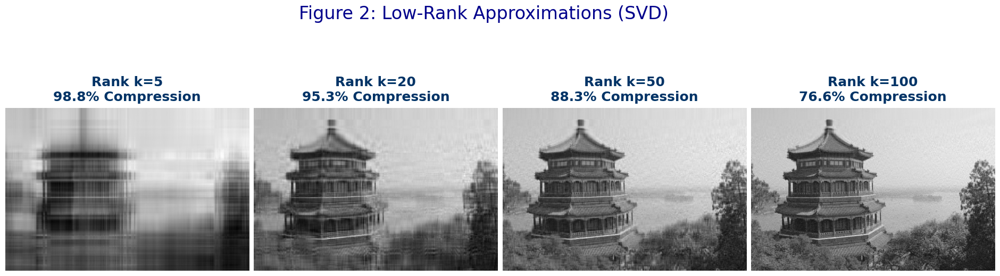
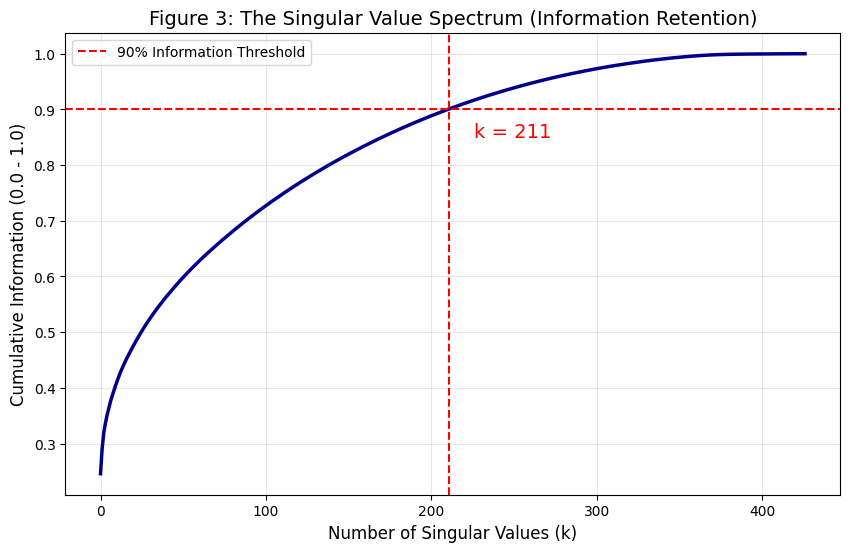
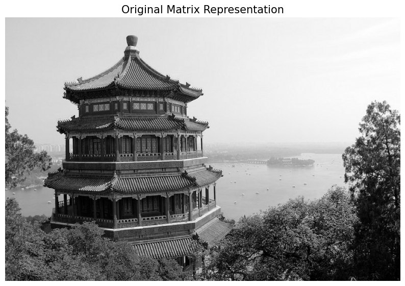
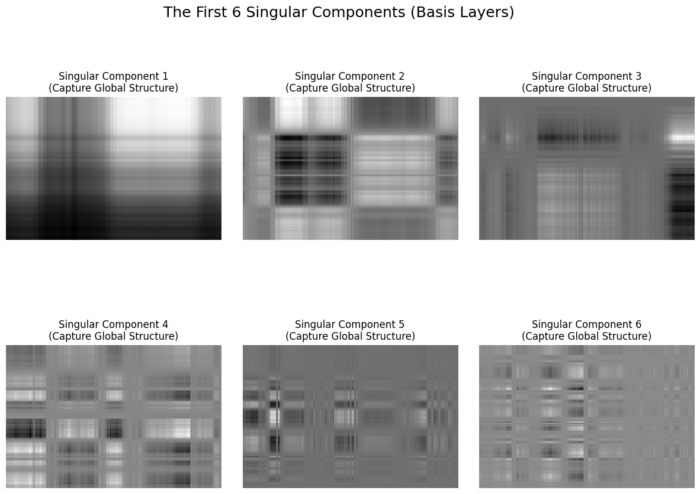

# SVD Image Compression using Linear Algebra

A Python implementation of **Singular Value Decomposition (SVD)** for image compression using **low-rank matrix approximation**. This project demonstrates how Linear Algebra can efficiently compress images while preserving most of their visual information.

---

## Overview

Images can be represented as matrices, making them suitable for analysis using Linear Algebra. This project applies **Singular Value Decomposition (SVD)** to decompose an image into orthogonal basis components and reconstruct it using only the most significant singular values.

### Features

- Matrix decomposition using Singular Value Decomposition (SVD)
- Low-rank image reconstruction
- Image compression using rank-k approximation
- Visualization of singular components (basis layers)
- Information retention analysis using the singular value spectrum
- Compression ratio analysis for different values of **k**

---

# Results

## Low-Rank Image Reconstruction

The image is reconstructed using different numbers of singular values.

<p align="center">
  
</p>

| Rank (k) | Compression | Observation |
|----------:|------------:|------------|
| 5 | 98.8% | Only global structure is preserved |
| 20 | 95.3% | Main architectural features become visible |
| 50 | 88.3% | Fine textures and details emerge |
| 100 | 76.6% | Nearly indistinguishable from the original |

---

## Singular Value Spectrum

The cumulative singular value spectrum shows how much information is retained as more singular values are included.

<p align="center">
  
</p>

**Result:** Approximately **211 singular values** retain **90%** of the image information.

---

## Original Image

<p align="center">
  
</p>

---

## Singular Components (Basis Layers)

The first six singular components represent the orthogonal basis images used to reconstruct the original image.

<p align="center">
  
</p>

---

# Mathematical Background

Given an image matrix

\[
A \in \mathbb{R}^{m \times n}
\]

Singular Value Decomposition factors the matrix as

\[
A = U\Sigma V^T
\]

where

- **U** → Left Singular Vectors
- **Σ** → Singular Values
- **Vᵀ** → Right Singular Vectors

The optimal rank-k approximation is

\[
A_k = U_k\Sigma_kV_k^T
\]

according to the **Eckart–Young–Mirsky Theorem**, which guarantees the best low-rank approximation in terms of reconstruction error.

---

# Dataset

- **Dataset:** Scikit-Learn China Sample Image
- **Original Resolution:** 427 × 640 pixels
- Converted to grayscale
- Pixel values normalized to the range **[0,1]**

---

# Technologies Used

- Python
- NumPy
- SciPy
- Matplotlib
- Scikit-Learn
- Jupyter Notebook

---

# Repository Structure

```text
svd-image-compression/
│
├── images/
│   ├── original-image.png
│   ├── singular-components.png
│   ├── low-rank-reconstruction.png
│   └── singular-value-spectrum.png
│
├── SVD_Image_Compression.ipynb
├── Project_Report.pdf
├── requirements.txt
├── README.md
├── LICENSE
└── .gitignore
```

---

# Installation

Clone the repository

```bash
git clone https://github.com/sujeeth-kumar/svd-image-compression.git
```

Move into the project directory

```bash
cd svd-image-compression
```

Install the required packages

```bash
pip install -r requirements.txt
```

Launch Jupyter Notebook

```bash
jupyter notebook
```

Open

```text
SVD_Image_Compression.ipynb
```

and run all cells.

---

# Key Learnings

- Singular Value Decomposition (SVD)
- Matrix Factorization
- Low-Rank Approximation
- Image Compression
- Spectral Analysis
- Numerical Linear Algebra
- Scientific Computing
- Scientific Visualization

---

# Future Improvements

- Support color image compression
- Compare SVD with JPEG compression
- Evaluate reconstruction using PSNR and SSIM metrics
- Develop an interactive web application for selecting rank **k**
- Extend the approach to video compression

---

# References

1. Gilbert Strang, *Introduction to Linear Algebra*
2. Eckart, C., & Young, G. (1936). *The Approximation of One Matrix by Another of Lower Rank*
3. Scikit-Learn Documentation

---

# Author

**Sujeeth Kumar Chunarkar**

B.Tech in Artificial Intelligence  
Indian Institute of Technology Kharagpur
